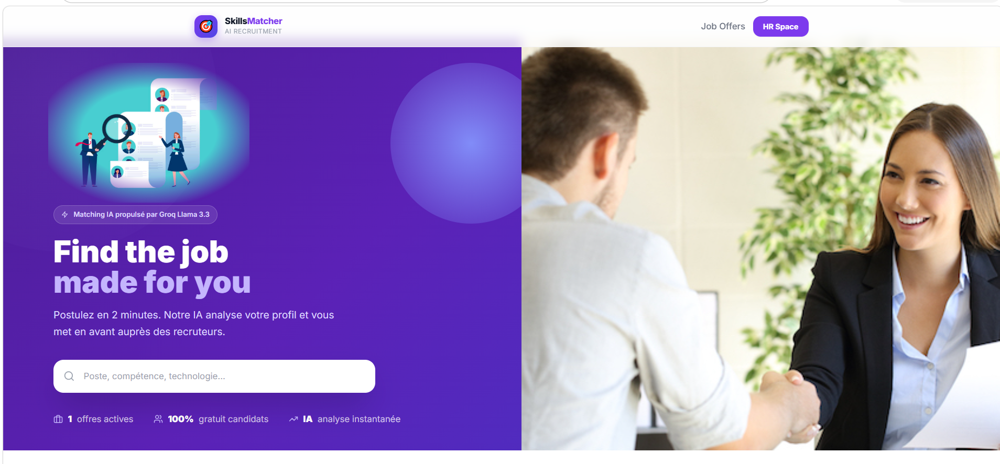
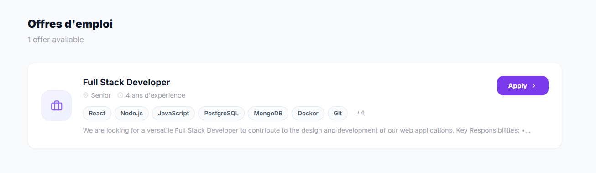
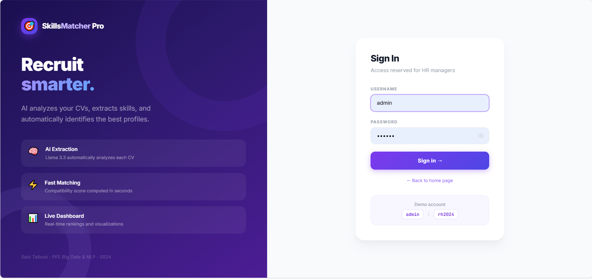
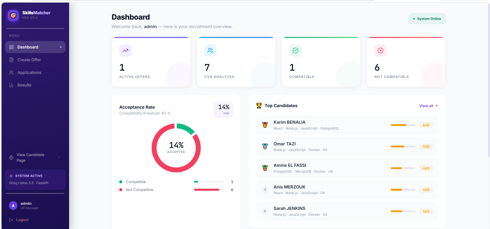
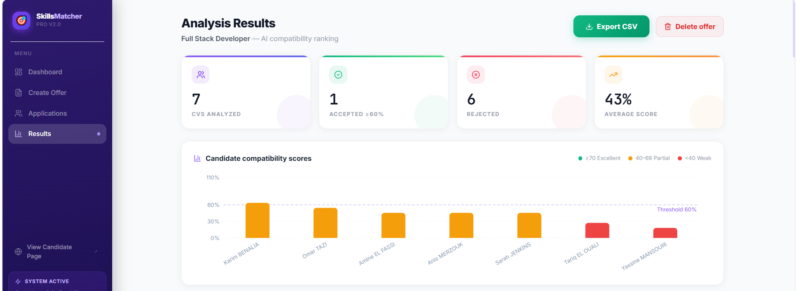
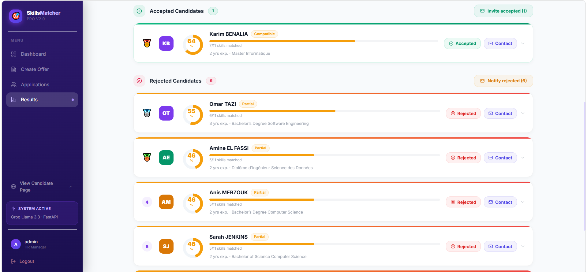
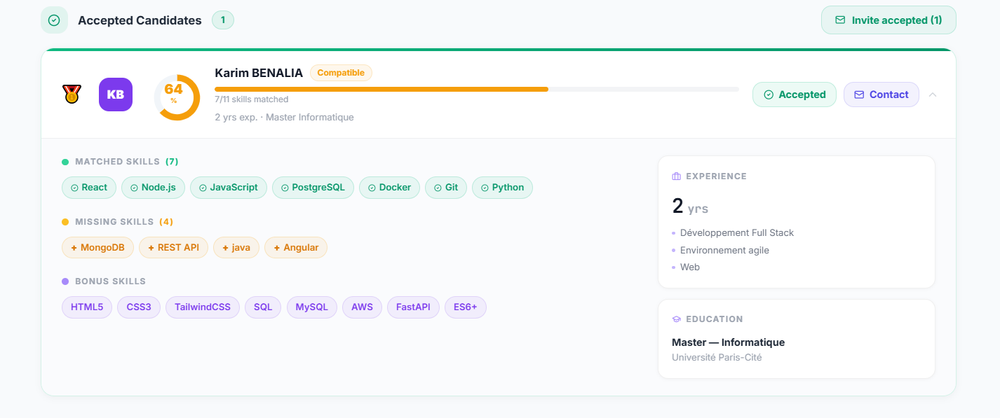
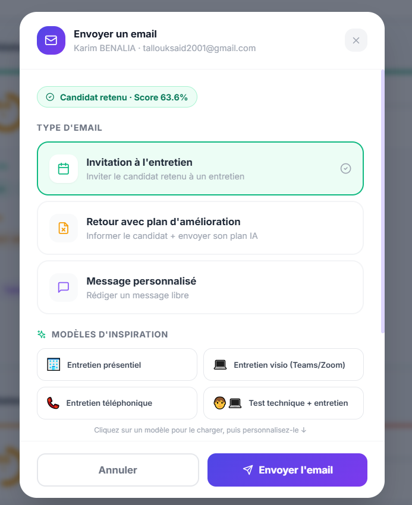
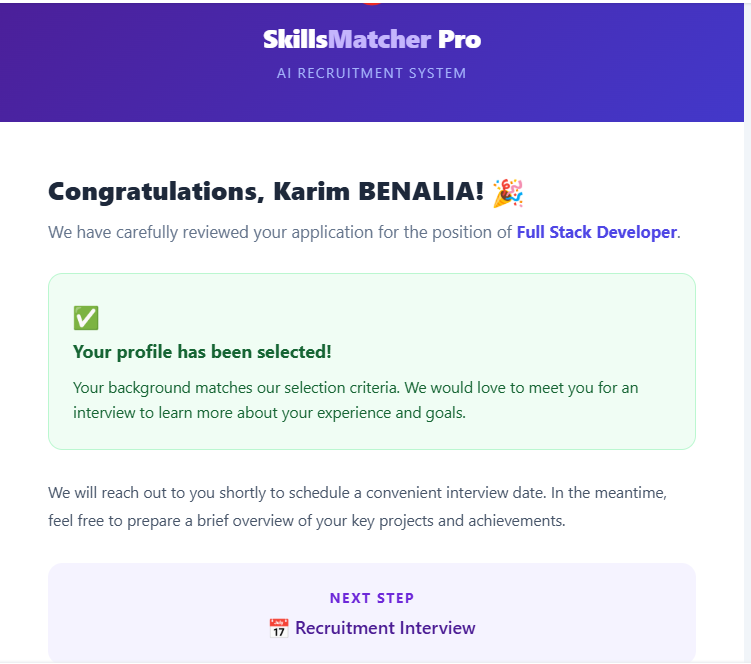

<div align="center">

# 🎯 Skills Matcher Pro

**AI-powered ATS that matches CVs against a job offer and guides rejected candidates toward the right training.**

[](frontend)
[](backend)
[](utils/llm_extractor.py)
[](frontend/vite.config.js)
[](https://ai-driven-candidate-selection-platf.vercel.app)
[](https://skills-matcher-pro-api-production.up.railway.app)

**[🚀 Live Demo](https://ai-driven-candidate-selection-platf.vercel.app)** · **[📄 API Docs](https://skills-matcher-pro-api-production.up.railway.app/docs)** · **[🏛️ Architecture](#architecture)**



</div>

## Screenshots

<table>
<tr>
<td width="50%">

**Candidate portal — Home**


</td>
<td width="50%">

**Candidate portal — Job offers**


</td>
</tr>
<tr>
<td width="50%">

**HR space — Login**


</td>
<td width="50%">

**HR space — Dashboard**


</td>
</tr>
<tr>
<td width="50%">

**AI analysis — Results overview**


</td>
<td width="50%">

**AI analysis — Candidates list**


</td>
</tr>
<tr>
<td width="50%">

**AI analysis — Candidate detail**


</td>
<td width="50%">

**Communication — Send email**


</td>
</tr>
</table>

## Architecture

Three-tier application: a **React SPA (frontend)**, a **FastAPI REST API (backend)**, and a shared **utils/** folder that encapsulates PDF extraction, AI (Groq), and email sending. Persistence is done with plain JSON files (no database).

```
┌─────────────────────┐        HTTP/JSON (axios)        ┌──────────────────────┐
│  frontend/ (React)   │ ───────────────────────────────▶│  backend/main.py     │
│  Vite · port 5173    │◀─────────────────────────────── │  FastAPI · port 8000 │
└─────────────────────┘                                   └──────────┬───────────┘
                                                                      │
                                                     ┌────────────────┼────────────────┐
                                                     ▼                ▼                ▼
                                          utils/llm_extractor.py  utils/email_sender.py  data/db/*.json
                                          (Groq · Llama-3.3-70B)  (SMTP Gmail)           (offers, applications,
                                                                                          analyses, CVs)
```

### backend/ — FastAPI API (`main.py`)

Single entry point, no database: all state is loaded into memory at startup from `data/db/*.json` and written back to disk on every mutation (`_persist()` function).

- **Auth** — `POST /api/auth/login` / `POST /api/auth/logout`. Hard-coded credentials in `_USERS` (`admin`/`rh2024`, `rh`/`password123`), opaque token (`uuid4`) stored in `_TOKENS` (in-memory, lost on restart). All HR routes require an `Authorization: Bearer <token>` header (`_require_auth` dependency).

  

- **Job offers (HR)** — CRUD on `/api/offers` (manual creation or PDF upload via `/api/offers/upload-pdf`), publishing via `PATCH /api/offers/{id}/publish`.
- **Public candidate portal** — `/api/public/offers` (list of published offers, without the `text` field) and `/api/public/offers/{id}/apply` (application submission: name, email, PDF stored at `data/db/cvs/{uuid}.pdf`).

  

- **Applications (HR)** — listing and downloading CVs (`/api/offers/{id}/applications`, `.../cv`).
- **AI analysis** — `POST /api/offers/{id}/analyze-applications` (all applications) or `.../applications/{app_id}/analyze` (a single one): extracts the CV profile via Groq, computes the match rate against the offer's required skills (`compare_skills`), and generates an improvement plan if `match_rate < 60`. `POST /api/analysis/{id}` also allows an ad-hoc analysis via direct PDF upload (without going through an application).

   

- **Communication** — `POST /api/communication/send` (single email) and `.../send-bulk` (bulk email by category: accepted/rejected/all), HTML templates in `utils/email_sender.py`, history stored per candidate.

   

- **Dashboard** — `GET /api/dashboard` aggregates global stats (offers, applications, average rate, top candidates).

  

CORS origins are configurable via the `ALLOWED_ORIGINS` env var (comma-separated list), defaulting to `http://localhost:5173,http://localhost:3000` for local development.

### frontend/ — React + Vite SPA

- **Routing** (`App.jsx`, `react-router-dom`): `Login`, `Dashboard`, `CreateOffer`, `UploadCVs`, `Applications`, `Results`, `PublicOffers` (unauthenticated candidate portal), `Apply` (public application form).

  

- **Auth state** — `context/AuthContext.jsx` holds the token and exposes it to API calls.
- **API client** — `api/client.js` (axios instance + token interceptor), `api/parseError.js` (FastAPI error normalization).
- **Components** — `Sidebar`, `KpiCard`, `DonutChart` (recharts), `SkillPill`, `ImprovementPlan`, `CommunicationModal`.

  

- **Styling** — Tailwind CSS (`tailwind.config.js`, `index.css`).

### utils/ — shared business logic

- `llm_extractor.py` — calls Groq (model `llama-3.3-70b-versatile`) to extract a structured profile (skills, experience, education) from a CV/offer text (`extract_profile`), compare skills (`compare_skills`), and generate a personalized improvement plan (`generate_improvement_plan`). **This is the scoring engine actually used by `backend/main.py`.**
- `email_sender.py` — builds HTML emails (interview / rejection / custom message) and sends them via Gmail SMTP.
- `processing.py` + `model.py` (+ `model.joblib`) — legacy **Word2Vec** similarity engine (Streamlit) inherited from an earlier version of the app; **not imported by the current backend**, kept around but unused.

### data/

- `data/ACCOUNTANT/`, `data/HR/`, `data/IT/`, … — sample CV datasets by job category.
- `data/db/` — persistent application state: `offers.json`, `applications.json`, `analyses.json`, and application PDFs under `data/db/cvs/`.

## Prerequisites

- Python 3.10+
- Node.js 18+

## Installation

```bash
# Backend
pip install -r backend/requirements_api.txt

# Frontend
cd frontend
npm install
```

## Configuration

Create a `.env` file at the project root with:

```
GROQ_API_KEY=...        # Groq API key (https://console.groq.com/keys)
SMTP_EMAIL=...           # Gmail address used to send emails
SMTP_PASSWORD=...        # Gmail App Password (https://myaccount.google.com/apppasswords)
PORT=8000                # backend port (optional)
```

## Getting started

### Option 1 — all-in-one script (Windows)

```bash
start.bat
```

Launches the backend and frontend in two separate windows.

### Option 2 — manual

Start the backend **before** the frontend (the frontend calls the API as soon as the login page loads):

```bash
# Terminal 1 — backend (port 8000), from the project root
uvicorn backend.main:app --reload --port 8000

# Terminal 2 — frontend (port 5173)
cd frontend
npm run dev
```

- API available at [http://localhost:8000](http://localhost:8000), interactive auto-generated docs at [http://localhost:8000/docs](http://localhost:8000/docs) (FastAPI Swagger UI).
- Frontend at [http://localhost:5173](http://localhost:5173).

### Demo accounts (HR)

| Username | Password |
|---|---|
| `admin` | `rh2024` |
| `rh` | `password123` |

The candidate portal (`/PublicOffers` then `/Apply`) requires no authentication — only published offers (`published: true`) are visible there.

## Deployment

The frontend (static React SPA) and backend (stateful FastAPI server) are deployed separately — Vercel only runs serverless functions and cannot host the backend as-is (it keeps auth tokens in memory and persists data to local JSON files/disk).

### Backend — Render

1. Push this repo to GitHub, then on [Render](https://dashboard.render.com), **New → Blueprint**, and point it at the repo — it picks up [`render.yaml`](render.yaml) automatically (build: `pip install -r backend/requirements_api.txt`, start: `uvicorn backend.main:app --host 0.0.0.0 --port $PORT`).
2. Set the environment variables in the Render dashboard (left as `sync: false` in the blueprint, so they must be entered manually): `GROQ_API_KEY`, `SMTP_EMAIL`, `SMTP_PASSWORD`, and `ALLOWED_ORIGINS` (set it once you know the Vercel URL, e.g. `https://your-app.vercel.app`).
3. Note the resulting API URL, e.g. `https://skills-matcher-pro-api.onrender.com`.

> **Persistence caveat**: Render's **free** plan has an ephemeral filesystem — `data/db/*.json` and uploaded CVs are wiped on every restart/redeploy. For real persistence, upgrade the service to a paid instance type and add a disk in `render.yaml`:
> ```yaml
>     disk:
>       name: data
>       mountPath: /opt/render/project/src/data/db
>       sizeGB: 1
> ```

### Frontend — Vercel

1. On [Vercel](https://vercel.com/new), import the same GitHub repo and set **Root Directory** to `frontend` (Vercel auto-detects the Vite framework preset; [`frontend/vercel.json`](frontend/vercel.json) adds the SPA rewrite needed for client-side routes like `/dashboard` or `/apply/:id` to work on direct load/refresh).
2. Add an environment variable `VITE_API_URL` = `https://<your-render-service>.onrender.com/api` (see [`frontend/.env.example`](frontend/.env.example)).
3. Deploy. Then go back to Render and set `ALLOWED_ORIGINS` to the resulting Vercel URL so the backend's CORS accepts it.

### Troubleshooting

- **"Missing Groq API key"** during an analysis → check `GROQ_API_KEY` in `.env` and restart the backend (env vars are read at startup via `load_dotenv`).
- **Email not sent** → `SMTP_EMAIL`/`SMTP_PASSWORD` must use a [Gmail App Password](https://myaccount.google.com/apppasswords), not the account password.
- **401 on all HR routes** → the token is stored in memory on the backend and lost on every restart (including `--reload`); log in again from the frontend after restarting the backend.
- **CORS blocked** → the frontend must run on port 5173 or 3000 (the only allowed origins, see `backend/main.py`).
